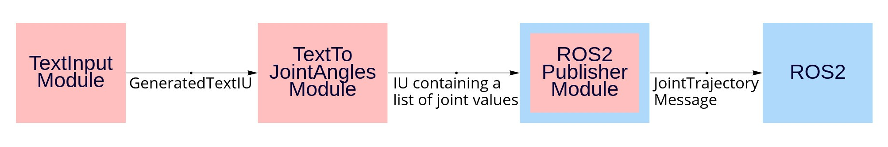

Before running any demo script, you need to do the followings:
1. Start the robot driver:  <!--change the ros ip controller as well-->
```bash
# real robot
ros2 launch ur_bringup ur_control.launch.py ur_type:=ur3e robot_ip:=192.168.0.4 launch_rviz:=true reverse_ip:=<your ip> limited:=true
# else
ros2 launch ur_bringup ur_control.launch.py ur_type:=ur3e robot_ip:=yyy.yyy.yyy.yyy launch_rviz:=true use_fake_hardware:=true limited:=true
```
2. Make sure you have replaced {{SERVER_IP_REPLACE}} of the file cocobots_ws/src/Universal_Robots_ROS2_Driver/ur_robot_driver/resources/ros_control.urscript with your host IP.

3. run the demo script in another terminal

## `demo_retico_ros2_publisher.py`
### Running the Script
```bash
python demo_retico_ros2_publisher.py
```
- In the terminal where you have run the script, type any command to let the robot move, e.g.: "move to the left", "go up!" etc.
- You should then see the robot moving (in Rviz and/or in the reality).

### Description
In a nutshell, this demo program first gets the command (e.g. "move to the left") from command line, converts it into joint values that will be passed to ROS. The robot arm will then move according to those joint values. This is how the pipeline looks like:
 <!--cannot be displayed lol-->

- `TextInputModule` is responsible for getting command from command line.
- `TextToJointAnglesModule` converts the text command to a list of joint (floats) values and pack them into an IncrementalUnit, based on the dictionary in `retico_ros2/config/joint_values.json`.
- `ROS2PublisherModule` is a **general** ReTiCo Module as well as a ROS publisher node which translates an ReTiCo IncrementalUnit to a ROS Message. In this example:
    1. its name, as a ROS publisher node, is `publisher_joint_trajectory_controller`.
    2. it takes the function `to_ur3e_joint_angles()` which converts an IncrementalUnit containing list of joint values to the ROS message of `JointTrajectory` type.
    3. it publishes the `JointTrajectory` message to the ROS topic `/joint_trajectory_controller/joint_trajectory`.
    4. The robot controller node `/joint_trajectory_controller/` subscribes to the ROS topic in (4).

The following extract from the rqt graph visualizes how `ROS2PublisherModule` communicates with ROS:


## `demo_retico_ros2_subscriber.py`


